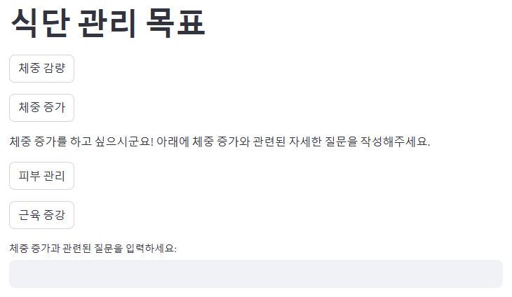
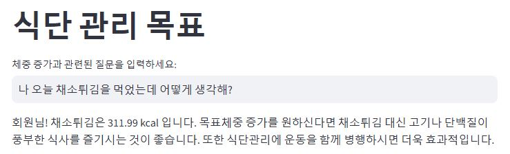

# 식단관리 챗봇



사용자가 어떤 음식을 먹었는지 알려주면, 선택한 목표에 맞게 식단관리 조언을 해주는 챗봇입니다.

목표는 네가지가 있습니다.
- 체중 감량
- 체중 증가
- 피부 관리
- 근육 증강

버튼을 눌러 목표를 선택한후 아래 질문란에 어떤 음식을 먹었는지 알려주면, 그 음식의 칼로리와 함께 목표와 관련된 조언을 해줄 것입니다.



추후에 사용자가 음식이미지를 업로드하면 이미지 속 음식들을 객체인식해 식단관리를 해주는 기능을 추가할 예정입니다.

사용법:
명령 프롬프트에서 'app_new.py' 파일을 streamlit 으로 실행하면 됩니다.
```streamlit run app_new.py```

음식 정보 출처: https://aihub.or.kr/aihubdata/data/view.do?currMenu=115&topMenu=100&aihubDataSe=data&dataSetSn=74