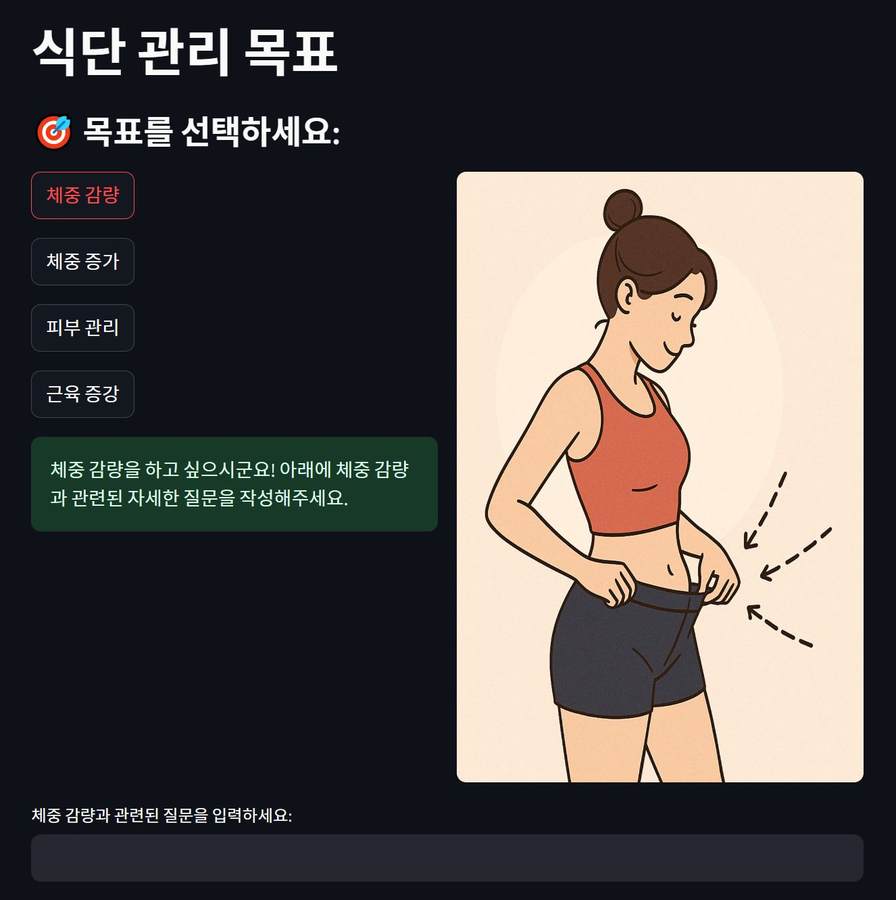
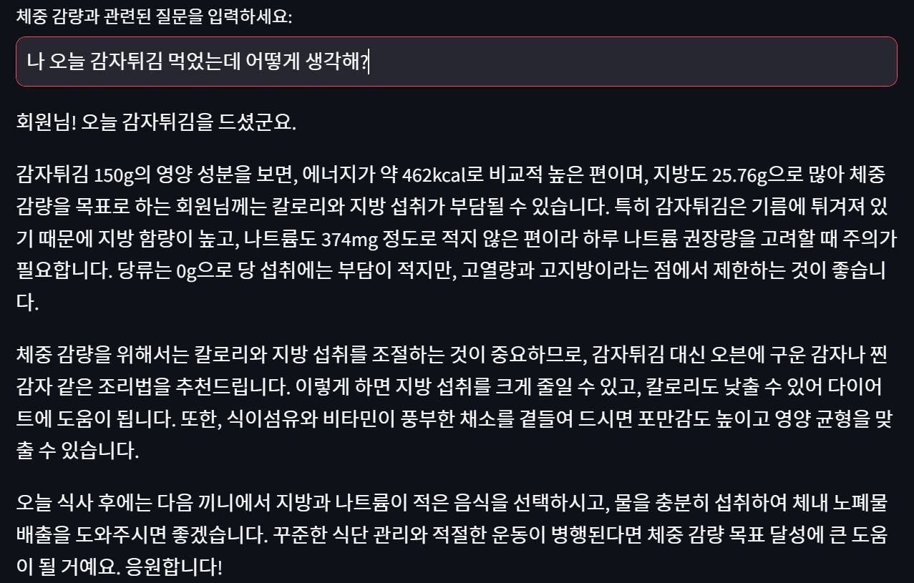
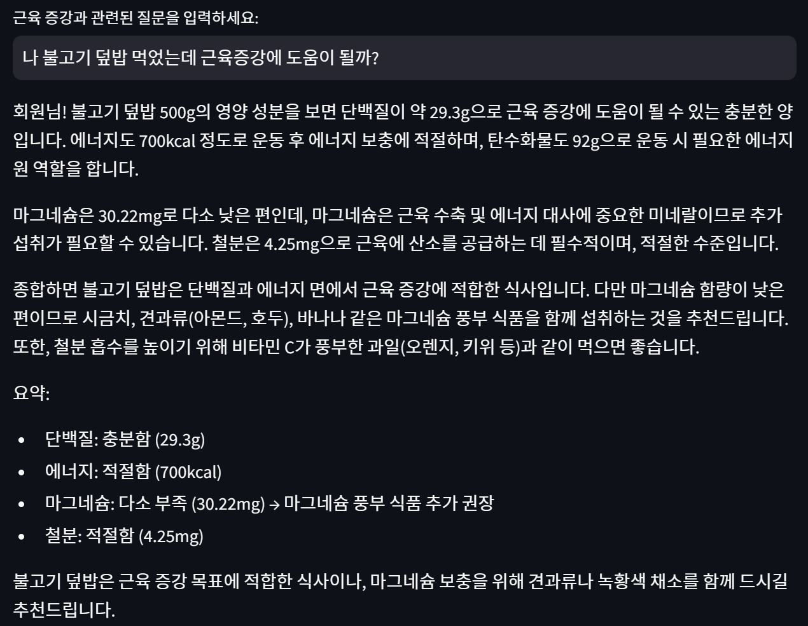

# 식단관리 챗봇 (영양 분석 기반 건강 조언 시스템)

사용자가 먹은 음식을 입력하면, 선택한 건강 목표에 따라 식단 정보를 분석해 맞춤형 조언을 제공하는 AI 챗봇입니다.

 

## 주요 기능

### 1. 목표 설정
사용자는 아래 네 가지 건강 목표 중 하나를 선택할 수 있습니다.
  - **체중 감량**
  - **체중 증가**
  - **피부 관리**
  - **근육 증강**

선택한 목표에 따라 각기 다른 **영양소 기준**이 적용되어 식단을 평가하고 조언합니다.

---

### 2. 음식 입력 → 영양 분석
- 사용자가 "**오늘 감자튀김 먹었어**" 같은 자연어 문장으로 입력하면,
  - 문장 속 **음식명을 자동 추출**하고
  - 데이터베이스에서 해당 음식의 **칼로리 및 영양 성분**을 찾아,
  - 목표에 맞는 **맞춤형 식단 조언**을 제공합니다.

> 예: 근육 증강을 선택하고 `감자튀김 먹었어`라고 입력 →  
> `"단백질, 칼로리, 철분 등을 기준으로 근육 생성에 적절한 음식인지 분석 + 부족하면 대체 식품 추천"`

---

### 3. 음식명 인식 기능
- `감자튀김`, `감자 튀김`처럼 띄어쓰기 차이
- `김치찌개` vs `돼지고기김치찌개` 같은 단어 포함 관계  
등을 인식하여 **음식명을 유사하게 추출**하고 분석합니다.

---

### 4. 향후 개발 예정 기능
- 이미지 업로드를 통한 **음식 객체 탐지 + 분석**
  - 음식 사진만 올리면 자동으로 인식하고 영양 정보 + 조언 제공

---

## 사용법

1. Python 환경에서 필요한 패키지를 설치합니다.
2. .env 파일을 만들고 `OPENAI_API_KEY`를 넣습니다.
3. 명령 프롬프트(터미널)에서 아래 명령어 실행:  
`streamlit run app.py`
4. 웹 브라우저가 자동으로 열리며 챗봇이 실행됩니다.

---

## 데이터 출처

- **AI Hub – 음식 이미지 및 영양정보 텍스트**  
  [https://aihub.or.kr/aihubdata/data/view.do?currMenu=115&topMenu=100&aihubDataSe=data&dataSetSn=74](https://aihub.or.kr/aihubdata/data/view.do?currMenu=115&topMenu=100&aihubDataSe=data&dataSetSn=74)

---

## 예시 화면

### 사용자가 체중 감량을 선택하고 "감자튀김 먹었어"라고 입력한 경우

### 사용자가 근육 증강을 선택하고 "불고기 덮밥을 먹었어"라고 입력한 경우

